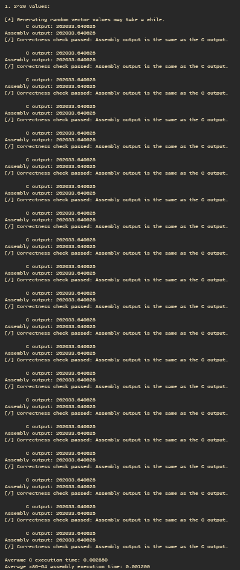

# Vector dot product C/Assembly comparison
## Submitted for LBYARCH.

# Debug mode
x86-64 assembly average execution time: 
C average execution time: 

---
# Release mode
x86-64 assembly average execution time: 
C average execution time: 

---
# Analysis
With the **debug mode**, we can see how the assembly kernel completes the task faster than it's c counterpart. With an the assembly kernel having an average exeution time of ______ and the c kernel has an average execution time of _____ for the vector sized at 2^20. For the vector sized at 2^24, the execution time is _____ and ____ for the assembly kernel and the c kernel, respectively. For the vector sized at 2^29, the execution time is _____ and ____ for the assembly kernel and the c kernel, respectively.

With the **release mode**, we can see that the c kernel runs relatively faster and can somewhat keep up or even outperform the execution time of the assembly kernel. With an the assembly kernel having an average exeution time of ______ and the c kernel has an average execution time of _____ for the vector sized at 2^20. For the vector sized at 2^24, the execution time is _____ and ____ for the assembly kernel and the c kernel, respectively. For the vector sized at 2^29, the execution time is _____ and ____ for the assembly kernel and the c kernel, respectively.

However, for the vector size of 2^29, the output of the process encounters floating point precision error which causes the output to be the same for each run of the program.

---
# Program output

