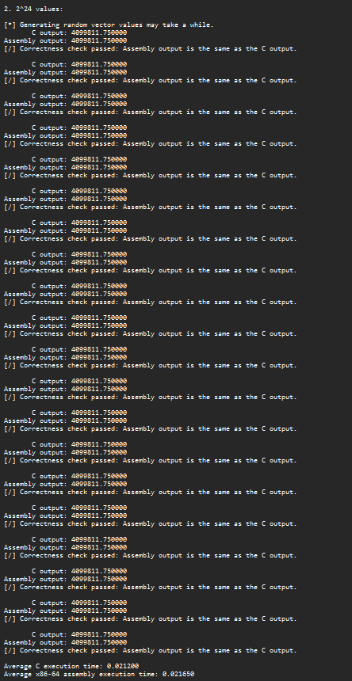

Jay Michael Carlos and Janica Megan Reyes - LBYARCH S14

# Vector dot product C/Assembly comparison
## Submitted for LBYARCH.

# Debug mode

## Execution time
### 2^20 elements
- C: 0.002800s
- x86-64 assembly: 0.001550s

### 2^24 elements
- C: 0.042500s
- x86-64 assembly: 0.024900s

### 2^29 elements
- C: 1.349350s
- x86-64 assembly: 0.791850s

---
# Release mode

## Execution time
### 2^20 elements
- C: 0.001450s
- x86-64 assembly: 0.001600s

### 2^24 elements
- C: 0.021200s
- x86-64 assembly: 0.021650s

### 2^29 elements
- C: 0.657800s
- x86-64 assembly: 0.665150s

---
# Analysis
In **debug mode**, the assembly kernel consistently completes the task significantly faster than its C counterpart— the C kernel has an average execution time of 0.002800s and the assembly kernel has an average execution time of 0.001550s for the vector sized at 2^20. For the vector sized at 2^24, the execution time is 0.042500s and 0.024900s for the C kernel and the assembly kernel, respectively. For the vector sized at 2^29, the execution time is 1.349350s and 0.791850s for the C kernel and the assembly kernel, respectively.

With the **release mode**, we can see that the C kernel runs relatively faster and can somewhat keep up and even outperform the execution time of the assembly kernel. This is thanks to the release mode adding more optimizations to the C code. The C code matches the assembly code at 2^20 elements and outperforms it when there are even more elements. The C kernel has an average execution time of 0.001450s and the assembly kernel has an average execution time of 0.001600s for the vector sized at 2^20. For the vector sized at 2^24, the execution time is 0.021200s and 0.021650s for the C kernel and the assembly kernel, respectively. For the vector sized at 2^29, the execution time is 0.657800s and 0.665150s for the C kernel and the assembly kernel, respectively.

It is important to note that for the vector size of 2^29, the output of the process encounters floating point precision error which causes the output to be the same for each run of the program. Lowering the number to 2^26 bypasses this issue.

---
# Source code, compilation, and execution demo

To view in higher quality: [https://youtu.be/L7hpy2iCz5U](https://youtu.be/L7hpy2iCz5U)
