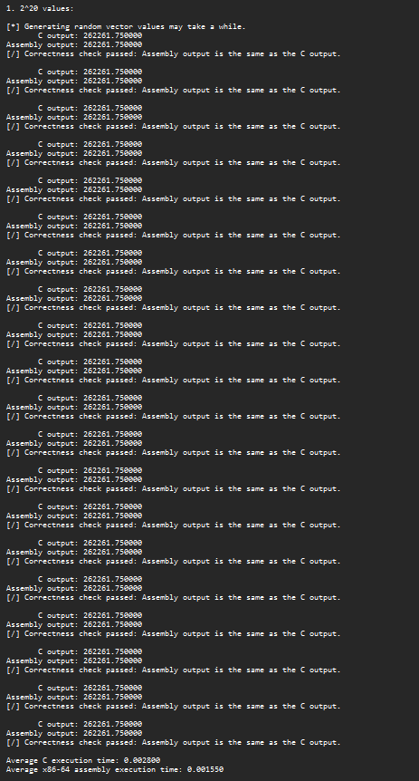
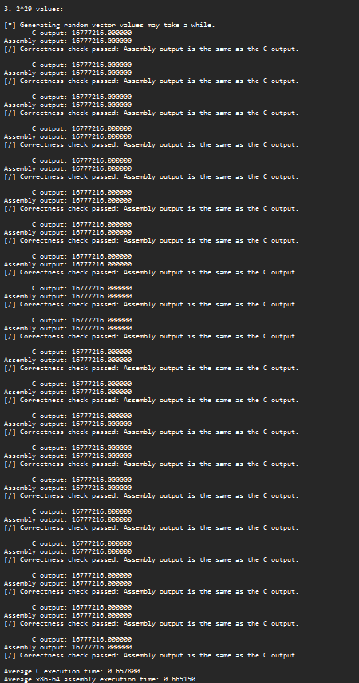

# Vector dot product C/Assembly comparison
## Submitted for LBYARCH.

# Debug mode

## Execution time
### 2^20 elements
- C: 0.002850s
- x86-64 assembly: 0.001200s

### 2^24 elements
- C: 0.041150s
- x86-64 assembly: 0.020550s

### 2^29 elements
- C: 1.652350s
- x86-64 assembly: 0.847450s

---
# Release mode

## Execution time
### 2^20 elements
- C: 0.001400s
- x86-64 assembly: 0.001400s

### 2^24 elements
- C: 0.020350s
- x86-64 assembly: 0.020750s

### 2^29 elements
- C: 0.025050s
- x86-64 assembly: 0.026400s

---
# Analysis
In **debug mode**, the assembly kernel consistently completes the task significantly faster than its C counterpart— the assembly kernel has an average execution time of 0.001200s and the C kernel has an average execution time of 0.002850s for the vector sized at 2^20. For the vector sized at 2^24, the execution time is 0.041150s and 0.020550s for the assembly kernel and the C kernel, respectively. For the vector sized at 2^29, the execution time is 1.652350s and 0.847450s for the assembly kernel and the C kernel, respectively.

With the **release mode**, we can see that the C kernel runs relatively faster and can somewhat keep up or even outperform the execution time of the assembly kernel. This is thanks to the release mode adding more optimizations to the C code. The C code matches the assembly code at 2^20 elements and outperforms it when there are even more elements.

It is important to note that for the vector size of 2^29, the output of the process encounters floating point precision error which causes the output to be the same for each run of the program. Lowering the number to 2^26 bypasses this issue.

---
# Source code, compilation, and execution demo
